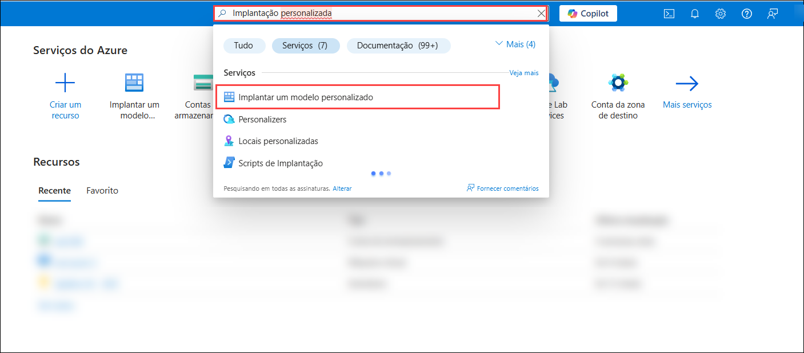
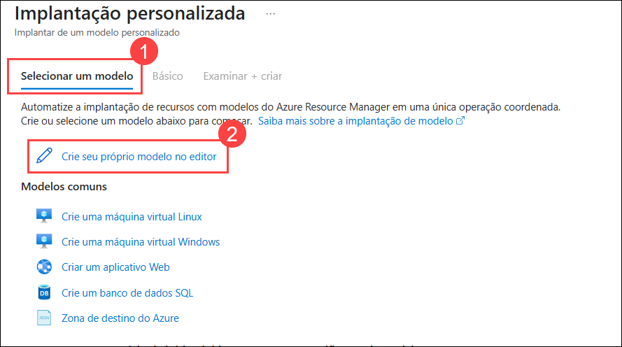
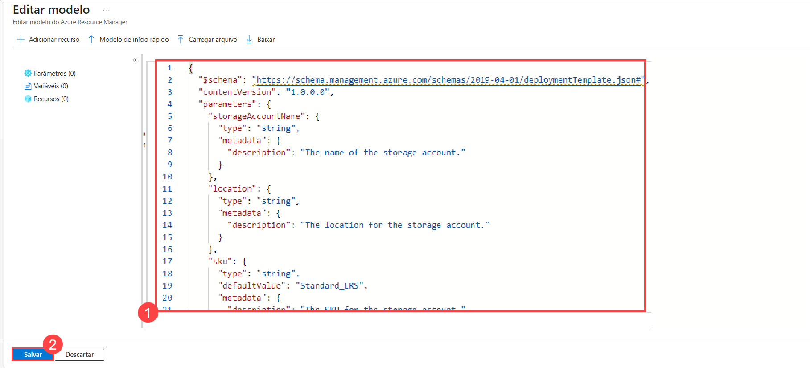

# Exercício 4: Utilização do GitHub Copilot Chat para gerar código ARM e Terraform com o Copilot

### Duração estimada: 25 minutos

## Sobre o GitHub Copilot Chat e o Visual Studio Code

O GitHub Copilot Chat permite-lhe fazer perguntas sobre código e receber respostas diretamente no IDE. O Copilot Chat pode ajudá-lo com uma variedade de tarefas relacionadas com a ecrita de código, como oferecer sugestões, fornecer descrições em linguagem natural da funcionalidade e finalidade de um trecho de código, gerar testes unitários para o seu código e propor correções para bugs. Para mais informações, consulte "[Sobre o GitHub Copilot Chat](https://docs.github.com/en/copilot/github-copilot-chat/about-github-copilot-chat)."

## Casos de utilização do GitHub Copilot Chat

Existem várias situações em que o GitHub Copilot Chat pode ajudar na codificação.

 - Geração de casos de testes unitários
 - Explicar o código
 - Propor correções de código
 - Respondendo a questões sobre código

Neste exercício, irá utilizar o Copilot para gerar código em ARM, Terraform e PowerShell.

> **Nota**: O GitHub Copilot irá sugerir automaticamente um corpo de função completa ou código em texto cinzento. A seguir, apresentamos alguns exemplos do que provavelmente verá neste exercício, mas a sugestão exata pode variar.

>**Nota**: Se não conseguir ver nenhuma sugestão do GitHub Copilot no VS Code, reinicie o VS Code uma vez e tente novamente.

## Objetivos do laboratório

Poderá completar as seguintes tarefas:

- Tarefa 1: Gerar código por chat que utilize ARM para implementar recursos no Azure
- Tarefa 2: Gerar código por chat que utiliza o Terraform para implementar recursos no Azure
- Tarefa 3: Gerar código por chat que utiliza o PowerShell para implementar recursos no Azure
- Tarefa 4: Enviar código para o seu repositório a partir de GitHub Codespaces

### Tarefa 1: Gerar código por chat que utiliza ARM para implementar recursos no Azure

1. Na barra de atividades do Visual Studio Code, clique no ícone GitHub Copilot Chat para abrir a janela GitHub Copilot Chat.

1. Na parte inferior da janela GitHub Copilot Chat, na caixa de texto **Ask Copilot or type / for commands**, digite uma pergunta relacionada com a codificação e prima Enter. Por exemplo, digite "Escreva um código ARM para implementar uma conta de armazenamento no Azure com a explicação do código".

   

1. O GitHub Copilot Chat processará a sua pergunta e fornecerá uma resposta, com sugestões de código quando apropriado, na janela de chat.

   

   

    > **Nota:** Eis um exemplo do que provavelmente verá; no entanto, a recomendação precisa pode variar.

    > **Nota**: Opcionalmente, se o GitHub Copilot Chat sugerir uma pergunta de seguimento acima da caixa de texto **Ask Copilot or type / for commands**, clique na pergunta de seguimento para a fazer.

    > **Nota**: Se a sua questão estiver fora do âmbito do GitHub Copilot Chat, este irá informá-lo e poderá sugerir uma questão alternativa a ser colocada.

1. Pode visualizar a resposta do GitHub Copilot no chat. Para inserir código num novo ficheiro, clique em **Reticências (...)** **(1)** e seleccione **Insert Into New File** **(2)**.

   

1. Prima `CTRL + S` para guardar o ficheiro. Nomeie o ficheiro como `arm.json` e clique em **OK**

   

1. Após salvar o arquivo, abra o ícone do portal do Azure na área de trabalho.

   

1. Na aba **Entrar no Microsoft Azure**, você verá uma tela de login. Digite o seguinte e-mail/nome de usuário e clique em **Avançar**.

   - **Email/Username:** <inject key="AzureAdUserEmail"></inject>

1. Agora digite a seguinte senha e clique em **Entrar**.

   - **Password:** <inject key="AzureAdUserPassword"></inject>

1. Se a janela pop-up **Permanecer conectado?** aparecer, clique em **Não**.

1. Selecione **Cancelar** na página **Bem-vindo ao Azure**.

1. Pesquise por **Implantação personalizada(1)** e selecione **Implantação personalizada(2)**.

   

1. Clique em **Selecionar um modelo(1)** e em **Crie seu próprio modelo no editor(2)**.

   

1. Copie e **cole(1)** o código que você salvou anteriormente no VS code na seção **Editar modelo** e clique em **Salvar(2)**.

      

1. Na seção de detalhes do projeto, adicione os seguintes detalhes:

   - Assinatura - **Selecione a assinatura padrão (1)**
   - Grupo de Recursos - **Selecione JumpVM-RG-<inject key="Deployment-id" enableCopy="false"/> (2)**
   - Região - **Selecione a região padrão. (3)**
   - Nome da Conta de Armazenamento - **storage<inject key="Deployment-id" enableCopy="false"/> (4)**
   - Clique em **Revisar + criar (5)**

1. Clique em **Criar**.

1. Clique em **Ir para o recurso**.

1. Verifique se a **Conta de armazenamento** foi criada.

### Tarefa 2: Gerar código por chat que utiliza o Terraform para implementar recursos no Azure

1. Na barra de atividades do Visual Studio Code, clique no ícone GitHub Copilot Chat para abrir a janela GitHub Copilot Chat.

1. Na parte inferior da janela GitHub Copilot Chat, na caixa de texto **Ask Copilot or type / for commands**, digite uma pergunta relacionada com a codificação e prima Enter. Por exemplo, digite "Escreva um código Terraform para implementar uma conta de armazenamento no Azure com a explicação do código".

   

1. O GitHub Copilot Chat processará a sua pergunta e fornecerá uma resposta, com sugestões de código quando apropriado, na janela de chat.

   

    > **Nota:** Eis um exemplo do que provavelmente verá; no entanto, a recomendação precisa pode variar.

    > **Nota**: Opcionalmente, se o GitHub Copilot Chat sugerir uma pergunta de acompanhamento acima da caixa de texto **Ask Copilot a question or type / for topics**, clique na pergunta de acompanhamento para a fazer.

    > **Nota**: Se a sua questão estiver fora do âmbito do GitHub Copilot Chat, este irá informá-lo e poderá sugerir uma questão alternativa a ser colocada.

1. Pode visualizar a resposta do GitHub Copilot no chat. Para inserir código num novo ficheiro, clique em **Reticências (...)** **(1)** e seleccione **Insert Into New File** **(2)**.

   

1. Prima `CTRL + S` para guardar o ficheiro. Nomeie o ficheiro como `terraform.tf` e clique em **OK**

   

### Tarefa 3: Gerar código por chat que utiliza o PowerShell para implementar recursos no Azure

1. Na barra de atividades do Visual Studio Code, clique no ícone GitHub Copilot Chat para abrir a janela GitHub Copilot Chat.

1. Na parte inferior da janela GitHub Copilot Chat, na caixa de texto **Ask Copilot or type / for commands**, digite uma codificação pergunta relacionada e prima Enter. Por exemplo, escreva "Escrever um script PowerShell para implementar uma conta de armazenamento no Azure".

   

1. O GitHub Copilot Chat processará a sua pergunta e fornecerá uma resposta, com sugestões de código quando apropriado, na janela de chat.

   

    > **Nota:** Eis um exemplo do que provavelmente verá; no entanto, a recomendação precisa pode variar.

    > **Nota**: Opcionalmente, se o GitHub Copilot Chat sugerir uma pergunta de acompanhamento acima da caixa de texto **Ask Copilot a question or type / for topics**, clique na pergunta de acompanhamento para a fazer.

    > **Nota**: Se a sua questão estiver fora do âmbito do GitHub Copilot Chat, este irá informá-lo e poderá sugerir uma questão alternativa a ser colocada.

1. Pode visualizar a resposta do GitHub Copilot no chat. Para inserir código num novo ficheiro, clique em **Reticências (...)** **(1)** e seleccione **Insert Into New File** **(2)**.

   

1. Pressione `CTRL + S` para guardar o ficheiro e verá uma recomendação para instalar a extensão `PowerShell`. Clique em Instalar. Nomeie o ficheiro como `powershell.ps1` e clique em **OK**.

   

### Resumo

Neste exercício, foi utilizado o Copilot para gerar código automaticamente em ARM, Terraform e PowerShell.

### Concluiu o laboratório com sucesso
